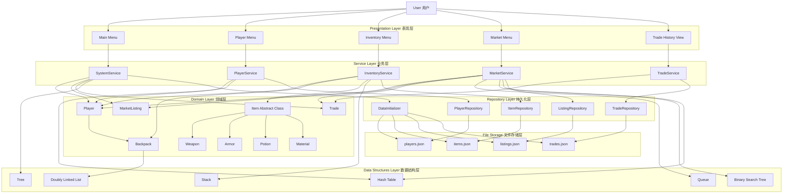

# Architecture Overview

A command-line game inventory and trading system built in pure Python with custom pointer-based data structures.

---

## Design Principles

- **No built-in `list`/`dict`/`set`** — all collections use custom pointer implementations
- **Strict layering** — dependencies flow top-down: presentation → service → repository → domain → data\_structures
- **Unified responses** — every service method returns a `Response` object
- **Unified exceptions** — all service errors are caught by the `@handle_exceptions` decorator

---

## Layer Architecture

```
┌─────────────────────────────────────┐
│         Presentation Layer          │
│  main_menu  inventory_menu          │
│  market_menu  profile_menu          │
└────────────────┬────────────────────┘
                 │ calls
┌────────────────▼────────────────────┐
│           Service Layer             │
│  PlayerService   InventoryService   │
│  MarketService   TradeService       │
│  SystemService                      │
└──────┬──────────────────┬───────────┘
       │ uses             │ uses
┌──────▼──────┐   ┌───────▼───────────┐
│   Domain    │   │  Data Structures  │
│  models     │   │  DoublyLinkedList │
│  constants  │   │  Stack / Queue    │
│  exceptions │   │  HashTable / BST  │
└──────┬──────┘   └───────────────────┘
       │
┌──────▼──────────────────────────────┐
│          Repository Layer           │
│  PlayerRepo  ItemRepo               │
│  ListingRepo  TradeRepo             │
│  DataInitializer                    │
└──────┬──────────────────────────────┘
       │ reads/writes
┌──────▼──────────────────────────────┐
│           File Storage              │
│  players.json   items.json          │
│  listings.json  buy/sell_records    │
│  item_config.json   save.json       │
└─────────────────────────────────────┘
```

---

## System Architecture Diagram



---

## Data Structures

Each structure is a pure pointer implementation — no Python built-ins.

| Class | Implementation | Used By | Key Operations |
|-------|---------------|---------|----------------|
| `DoublyLinkedList` | Doubly linked list | Backpack (item storage) | append, prepend, remove, traverse |
| `Stack` | Singly linked list | InventoryService (undo) | push, pop, peek |
| `Queue` | Singly linked list + tail ptr | MarketService (order queue) | enqueue, dequeue |
| `HashTable` | Separate chaining | PlayerService, MarketService | put, get, remove |
| `BinarySearchTree` | Recursive node pointers | MarketService (price search) | insert, search, range\_query |

---

## Domain Model

```
Item (abstract)
├── Weapon    — attack, durability
├── Armor     — defense, durability
├── Potion    — effect, duration
└── Material  — stackable crafting resource

Player
└── Backpack (DoublyLinkedList of Items)

MarketListing  — seller, item, price, timestamp
Trade          — buyer, seller, item, price, timestamp
```

---

## Service Layer Contracts

All service methods follow this pattern:

```python
@handle_exceptions
def method(self, ...) -> Response:
    if invalid:
        raise ValidationException(ErrorMessages.SOME_ERROR)
    # ... business logic ...
    return Response.ok(SuccessMessages.SOME_SUCCESS, data=result)
```

`Response` fields: `success: bool`, `message: str`, `data: Any`

---

## Key Flows

### Buy Item from Market
```
User input
  → MarketMenu.buy()
    → MarketService.buy_item(player_id, listing_id)
      → PlayerRepository.get(player_id)        # load buyer
      → ListingRepository.get(listing_id)      # load listing
      → [validate gold, validate not own listing]
      → Player.gold -= price
      → Backpack.append(item)                  # DoublyLinkedList
      → TradeRepository.save(trade)
      → ListingRepository.remove(listing_id)
      → PlayerRepository.save(player)
      → Response.ok(SuccessMessages.ITEM_BOUGHT)
```

### Sell Item to Market
```
User input
  → MarketMenu.sell()
    → MarketService.list_item(player_id, item_id, price)
      → [validate price range via PriceConfig]
      → Backpack.remove(item)
      → ListingRepository.save(listing)         # BST indexed by price
      → PlayerRepository.save(player)
      → Response.ok(SuccessMessages.ITEM_LISTED)
```

---

## Configuration Constants

```python
PlayerConfig.INITIAL_GOLD        # 1000.0 — starting gold for new players
PlayerConfig.MAX_BACKPACK_SIZE   # max items a backpack can hold

PriceConfig.MIN_PRICE_FACTOR     # 0.8 — floor: 80% of item base price
PriceConfig.MAX_PRICE_FACTOR     # 3.0 — ceiling: 300% of item base price
```

---

## File Storage

All persistence is JSON; no database dependency.

| File | Content | Written By |
|------|---------|------------|
| `players.json` | Player profiles + gold | PlayerRepository |
| `items.json` | Item definitions | ItemRepository |
| `listings.json` | Active market listings | ListingRepository |
| `buy_records.json` | Completed buy trades | TradeRepository |
| `sell_records.json` | Completed sell trades | TradeRepository |
| `item_config.json` | Item type config / base prices | DataInitializer |
| `save.json` | Session save state | SystemService |

---

## Testing

```bash
pytest                                    # all tests
pytest tests/unit/data_structures/ -v    # core data structures (98 tests)
pytest tests/unit/service/ -v            # service layer (27 tests)
```

| Suite | Tests | Scope |
|-------|-------|-------|
| `tests/unit/data_structures/` | 98 | Pointer-based structures |
| `tests/unit/domain/` | 30 | Models and enums |
| `tests/unit/repository/` | 5 | Persistence layer |
| `tests/unit/service/` | 27 | Business logic |
| `tests/integration/` | — | Cross-layer flows |
