# UML Class Diagram

```mermaid
classDiagram
    %% Domain Layer
    class Item {
        <<abstract>>
        -item_id: str
        -name: str
        -item_type: str
        -rarity: str
        -base_price: float
        -description: str
        +get_stats()* dict
        +to_dict() dict
    }

    class Weapon {
        -attack: int
        -durability: int
        +get_stats() dict
    }

    class Armor {
        -defense: int
        -durability: int
        +get_stats() dict
    }

    class Potion {
        -heal_amount: int
        +get_stats() dict
    }

    class Material {
        -stack_size: int
        +get_stats() dict
    }

    class Player {
        -player_id: str
        -name: str
        -gold: float
        -level: int
        -backpack: Backpack
        +earn_gold(amount)
        +spend_gold(amount) bool
        +to_dict() dict
        +from_dict(data)$ Player
    }

    class Backpack {
        -capacity: int
        -_items: DoublyLinkedList
        +add_item(item_id, quantity) bool
        +remove_item(item_id, quantity) bool
        +has_item(item_id, quantity) bool
        +get_quantity(item_id) int
        +total_slots() int
        +all_items() list
        +to_dict() dict
        +from_dict(data)$ Backpack
    }

    class MarketListing {
        -listing_id: str
        -seller_id: str
        -item_id: str
        -quantity: int
        -price_per_unit: float
        -created_at: str
        -status: str
        +total_price() float
        +to_dict() dict
        +from_dict(data)$ MarketListing
    }

    class Trade {
        -trade_id: str
        -listing_id: str
        -buyer_id: str
        -seller_id: str
        -item_id: str
        -quantity: int
        -price_per_unit: float
        -total_price: float
        -traded_at: str
        +to_dict() dict
        +from_dict(data)$ Trade
    }

    %% Data Structures Layer
    class DoublyLinkedList {
        -head: Node
        -tail: Node
        -_size: int
        +append(data) Node
        +prepend(data) Node
        +remove(node)
        +find(predicate) Node
        +size() int
        +iter()
    }

    class Node {
        -data: Any
        -prev: Node
        -next: Node
    }

    class Stack {
        -_data: list
        +push(item)
        +pop() Any
        +peek() Any
        +is_empty() bool
        +size() int
    }

    class Queue {
        -_data: deque
        +enqueue(item)
        +dequeue() Any
        +peek() Any
        +is_empty() bool
        +size() int
    }

    class Tree {
        -root: TreeNode
        +find(key) TreeNode
        +insert(parent_key, child_key, value) bool
        +traverse(node, depth)
    }

    class TreeNode {
        -key: str
        -value: Any
        -children: list
        +add_child(child)
    }

    class BinarySearchTree {
        -root: BSTNode
        +insert(key, value)
        +search(key) Any
        +delete(key)
        +inorder()
        +range_query(low, high)
    }

    class BSTNode {
        -key: float
        -value: Any
        -left: BSTNode
        -right: BSTNode
    }

    class HashTable {
        -_capacity: int
        -_buckets: list
        -_size: int
        +put(key, value)
        +get(key) Any
        +delete(key) bool
        +contains(key) bool
        +keys()
        +values()
        +items()
        +size() int
    }

    %% Repository Layer
    class PlayerRepository {
        -_path: str
        -_players: dict
        +load()
        +save()
        +find_by_id(player_id) Player
        +find_by_name(name) Player
        +all() list
        +save_player(player)
        +delete(player_id) bool
    }

    class ItemRepository {
        -_path: str
        -_items: dict
        +load()
        +save()
        +find_by_id(item_id) Item
        +find_by_type(item_type) list
        +all() list
        +save_item(item)
    }

    class ListingRepository {
        -_path: str
        -_listings: dict
        +load()
        +save()
        +find_by_id(listing_id) MarketListing
        +find_active() list
        +find_by_seller(seller_id) list
        +find_by_item(item_id) list
        +all() list
        +save_listing(listing)
        +delete(listing_id) bool
    }

    class TradeRepository {
        -_path: str
        -_trades: list
        +load()
        +save()
        +add(trade)
        +find_by_player(player_id) list
        +find_by_buyer(buyer_id) list
        +find_by_seller(seller_id) list
        +all() list
    }

    class DataInitializer {
        -_dir: str
        +initialize()
    }

    %% Service Layer
    class PlayerService {
        -_repo: PlayerRepository
        -_cache: HashTable
        +get_player(player_id) Player
        +get_by_name(name) Player
        +list_players() list
        +create_player(name, gold) Player
        +save_player(player)
        +delete_player(player_id) bool
    }

    class InventoryService {
        -_player_repo: PlayerRepository
        -_item_repo: ItemRepository
        -_undo_stack: Stack
        +get_inventory(player) list
        +add_item(player, item_id, quantity) bool
        +remove_item(player, item_id, quantity) bool
        +undo_last(player) str
        +sort_inventory_by_price(player) list
        +search_item_in_inventory(player, name) list
    }

    class MarketService {
        -_player_repo: PlayerRepository
        -_item_repo: ItemRepository
        -_listing_repo: ListingRepository
        -_trade_repo: TradeRepository
        -_order_queue: Queue
        -_price_bst: BinarySearchTree
        -_listing_cache: HashTable
        +list_item(seller, item_id, quantity, price) MarketListing
        +cancel_listing(seller, listing_id) bool
        +buy_item(buyer, listing_id) Trade
        +enqueue_buy_order(buyer_id, item_id, max_price)
        +process_order_queue() list
        +get_active_listings() list
        +search_by_item(item_id) list
        +search_by_price_range(low, high) list
    }

    class TradeService {
        -_repo: TradeRepository
        +get_all_trades() list
        +get_trades_for_player(player_id) list
        +get_purchases(player_id) list
        +get_sales(player_id) list
        +get_trade_volume(player_id) float
    }

    class SystemService {
        -_player_repo: PlayerRepository
        -_listing_repo: ListingRepository
        -_trade_repo: TradeRepository
        -_category_tree: Tree
        +get_category_tree() Tree
        +print_category_tree() str
        +get_system_stats() dict
        +initialize_data()
    }

    %% Presentation Layer
    class CLI {
        -_player_svc: PlayerService
        -_inventory_svc: InventoryService
        -_market_svc: MarketService
        -_trade_svc: TradeService
        -_system_svc: SystemService
        -_item_repo: ItemRepository
        -_current_player: Player
        +run()
        -_player_menu()
        -_inventory_menu()
        -_market_menu()
        -_trade_history_menu()
        -_system_menu()
    }

    %% Relationships - Domain
    Item <|-- Weapon
    Item <|-- Armor
    Item <|-- Potion
    Item <|-- Material
    Player *-- Backpack
    Backpack o-- DoublyLinkedList
    DoublyLinkedList o-- Node

    %% Relationships - Data Structures
    Tree o-- TreeNode
    BinarySearchTree o-- BSTNode

    %% Relationships - Repository
    PlayerRepository ..> Player
    ItemRepository ..> Item
    ListingRepository ..> MarketListing
    TradeRepository ..> Trade

    %% Relationships - Service
    PlayerService --> PlayerRepository
    PlayerService --> HashTable
    InventoryService --> PlayerRepository
    InventoryService --> ItemRepository
    InventoryService --> Stack
    MarketService --> PlayerRepository
    MarketService --> ItemRepository
    MarketService --> ListingRepository
    MarketService --> TradeRepository
    MarketService --> Queue
    MarketService --> BinarySearchTree
    MarketService --> HashTable
    TradeService --> TradeRepository
    SystemService --> PlayerRepository
    SystemService --> ListingRepository
    SystemService --> TradeRepository
    SystemService --> Tree

    %% Relationships - Presentation
    CLI --> PlayerService
    CLI --> InventoryService
    CLI --> MarketService
    CLI --> TradeService
    CLI --> SystemService
    CLI --> ItemRepository
```

## Architecture Overview

### Layered Architecture

1. **Presentation Layer** (CLI)
   - User interface and interaction
   - Menu navigation
   - Input/output handling

2. **Service Layer** (Business Logic)
   - PlayerService: Player management with hash table caching
   - InventoryService: Inventory operations with undo stack
   - MarketService: Market operations with queue, BST, and hash table
   - TradeService: Trade history queries
   - SystemService: System stats and category tree

3. **Domain Layer** (Core Models)
   - Item hierarchy (abstract Item → Weapon, Armor, Potion, Material)
   - Player with Backpack
   - MarketListing
   - Trade

4. **Data Structures Layer** (Custom Implementations)
   - DoublyLinkedList: Backpack item storage
   - Stack: Undo operations
   - Queue: Buy order queue
   - Tree: Item category hierarchy
   - BinarySearchTree: Price-sorted market search
   - HashTable: O(1) player/listing lookup

5. **Repository Layer** (Data Persistence)
   - JSON file-based storage
   - CRUD operations for all entities
   - DataInitializer for seed data

### Key Design Patterns

- **Repository Pattern**: Abstracts data access
- **Service Layer Pattern**: Encapsulates business logic
- **Composition**: Player contains Backpack, Backpack uses DoublyLinkedList
- **Abstract Factory**: Item hierarchy with polymorphic behavior
- **Strategy Pattern**: Different data structures for different use cases
