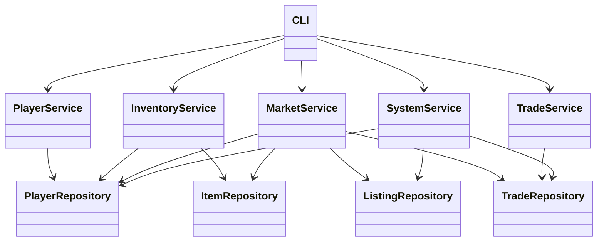
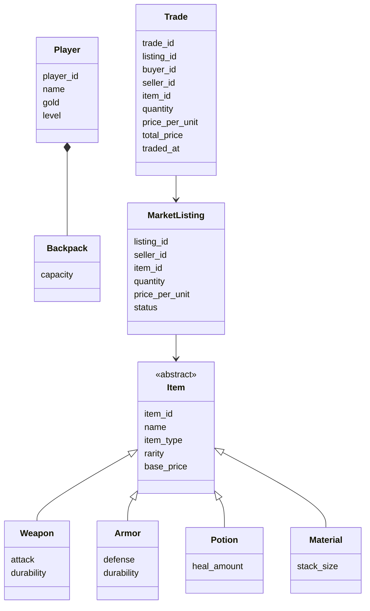
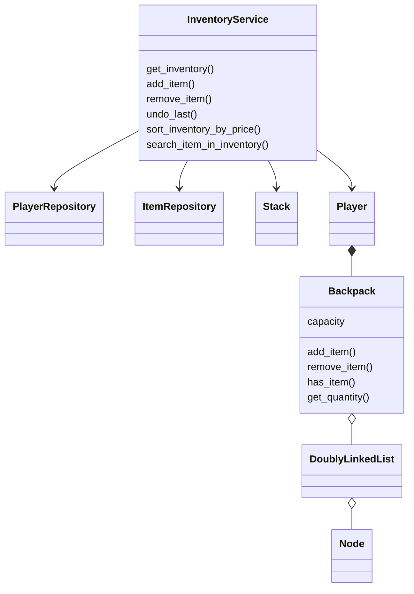
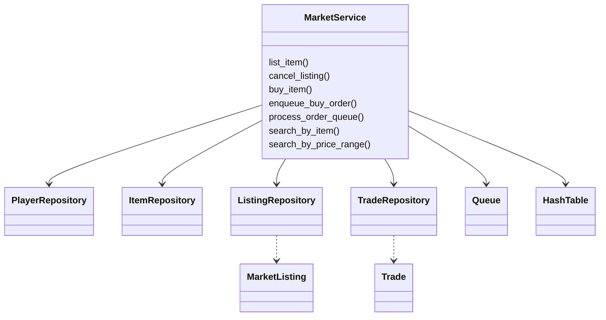
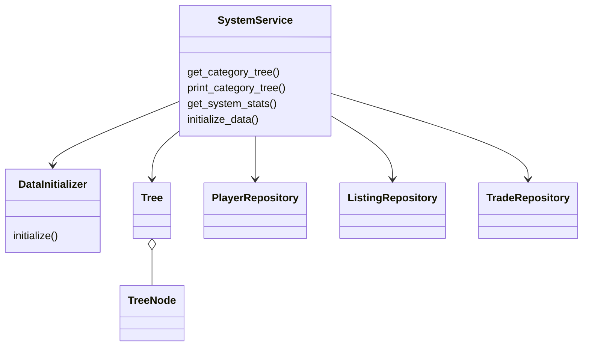
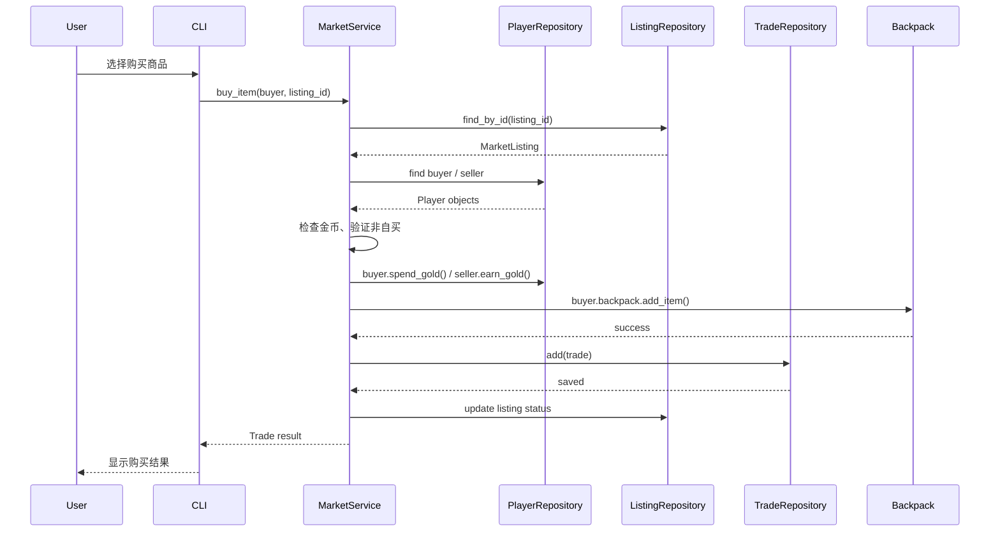
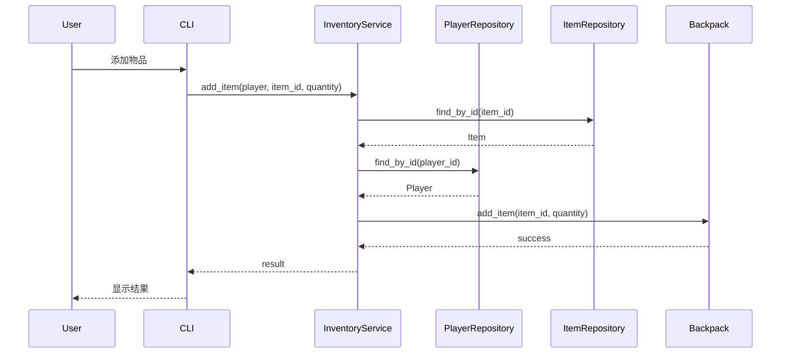

# 游戏交易系统 UML（团队阅读版）

> 目标：给组员快速理解系统结构。  
> 原则：**一张图只讲一个主题**，复杂模块单独拆开。

---

## 1. 阅读顺序

建议按下面顺序看：

1. **系统总览图**：先看系统分层和主依赖关系  
2. **核心领域模型图**：理解核心业务对象  
3. **背包模块图**：理解库存与背包  
4. **市场模块图**：理解交易与检索  
5. **关键流程时序图**：理解买卖过程

---

## 2. 系统总览图

这张图只回答一个问题：**系统由哪些层组成，谁依赖谁。**

### 说明
- **CLI**：用户入口，负责菜单、输入输出
- **Service**：业务逻辑层
- **Repository**：数据持久化层
- 这张图故意不展开属性和方法，避免信息过载

---

## 3. 核心领域模型图

这张图只回答一个问题：**系统里有哪些核心业务对象，它们之间是什么关系。**

### 说明
- **Item** 是抽象父类，不同物品类型继承它
- **Player 组合 Backpack**：玩家拥有自己的背包
- **MarketListing** 表示上架中的商品
- **Trade** 表示实际成交记录

---

## 4. 背包模块图

这张图只回答一个问题：**库存管理模块依赖什么，以及背包如何存储物品。**

### 说明
- **InventoryService** 负责库存增删查改
- **Stack** 用于撤销操作（undo），每个玩家独立维护一个栈
- **Backpack** 内部使用 **DoublyLinkedList** 存储条目
- **堆叠机制**：相同物品堆叠在同一槽位，不占用新槽位；只有新物品才需要新槽位
- 数据结构细节被限制在这个局部图里，不放到总览图中

---

## 5. 市场模块图

这张图只回答一个问题：**市场交易模块依赖哪些对象和数据结构。**

### 说明
- **ListingRepository**：管理上架单
- **TradeRepository**：管理成交记录
- **Queue**：处理买单队列（异步订单处理）
- **HashTable**：listing_id 快速查找（O(1) 复杂度）
- **价格索引**：使用 dict[price, list[listing_id]] 支持同价多商品和价格区间查询

---

## 6. 系统支撑模块图

这张图只回答一个问题：**系统统计、分类树、初始化功能如何组织。**

### 说明
- **SystemService**：偏系统管理和统计
- **Tree / TreeNode**：维护物品分类树
- **DataInitializer**：初始化种子数据

---

## 7. 关键流程时序图：购买商品

这张图只回答一个问题：**买家购买一个商品时，系统怎么协作。**

---

## 8. 关键流程时序图：背包加物品

---

## 9. 画图取舍说明

为保证清晰、易读，这份 UML 做了这些取舍：

- 去掉了大量 `to_dict()`、`from_dict()`、`save()` 之类实现细节
- 去掉了大部分简单 getter / utility 方法
- 把复杂数据结构从总图中拆出去，只在局部图中展示
- 保留了最关键的关系：继承、组合、依赖
- 把“总览”和“局部细化”分开，便于组员快速理解

---

## 10. 建议使用方式

组内分享时建议这样展示：

- 第 1 页：系统总览图
- 第 2 页：核心领域模型图
- 第 3 页：市场模块图
- 第 4 页：关键时序图

这样比把所有类堆在一张图里更容易读，也更方便讨论。

